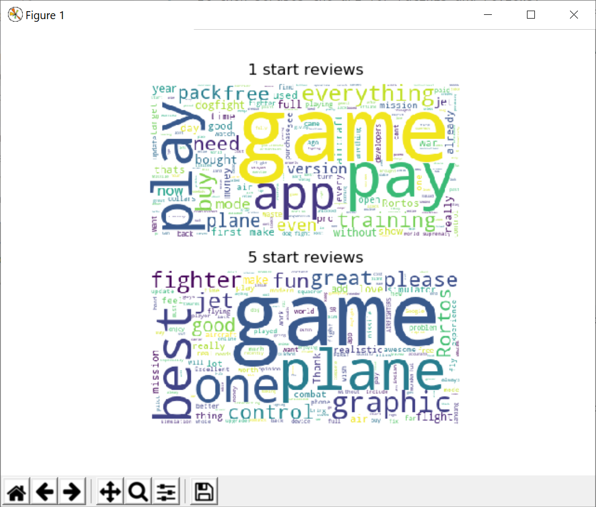
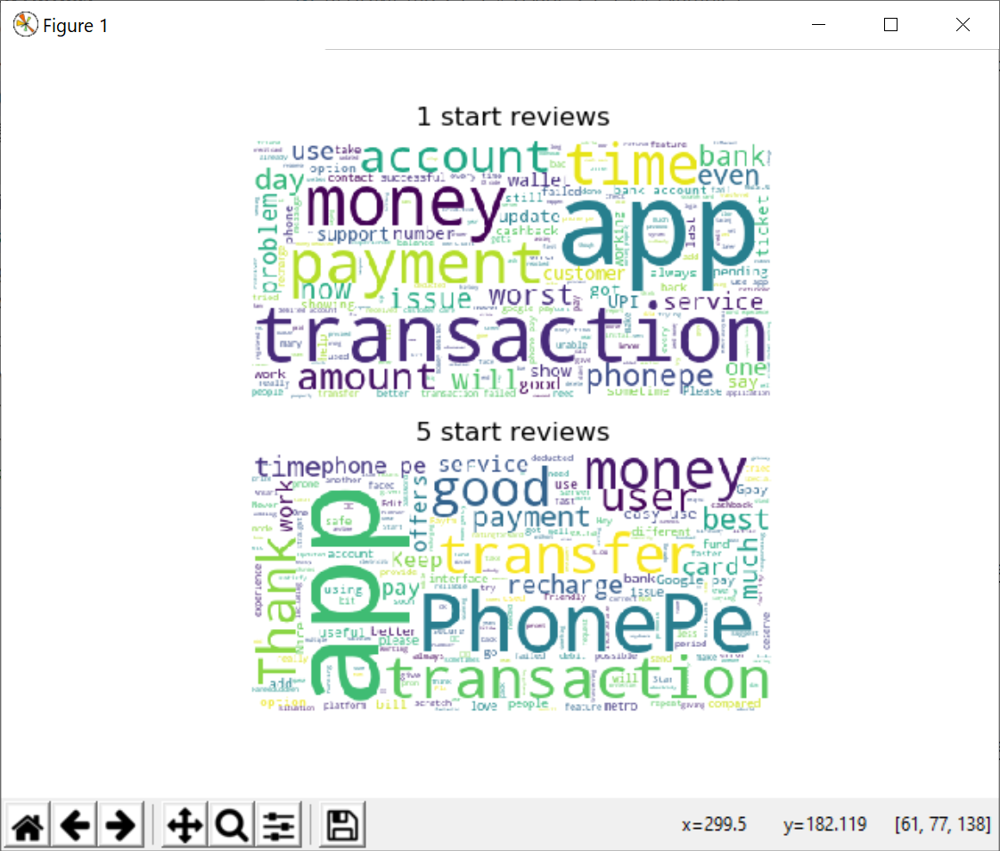

# Review wordcloud
Program for creating wordcloud of google app reviews

# Description
This program takes the url of a google app.
It then scrapes the url for ratings and reviews.
It uses the ratings and reviews to create a wordcloud of the top reviews (5 star) and lowest reviews (1 star)

Since the reviews page uses javascript, selenium and a webdriver are required to scrape the page.
The chrome driver can be downloaded here:
https://chromedriver.chromium.org/

# Usage
```
python main.py <https://url_for_google_app>
```
The following flags are supported:
- -s : Csv file to save ratings and reviews
- -d : Path to webdriver used for scraping

## Examples
Example 1: Air fighters app
```
python main.py 'https://play.google.com/store/apps/details?id=it.rortos.airfighters'
```


Example 2: Phone pe
```
python main.py 'https://play.google.com/store/apps/details?id=com.phonepe.app'
```

